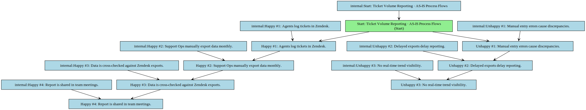
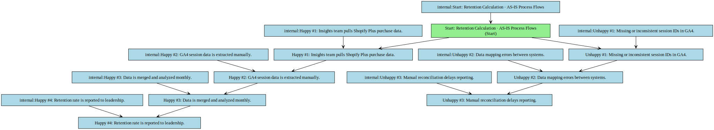
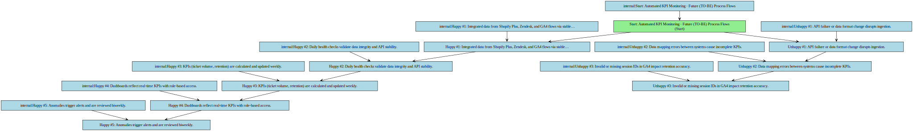
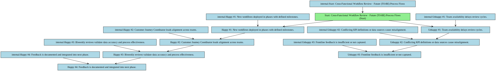

## Functional Specification: Customer Retention & Support Efficiency Enhancement Initiative

**1. Project Overview & Objectives**
This project aims to improve customer retention and reduce support ticket volume through phased integration of Shopify Plus, Zendesk, and GA4 data, enabling data-driven decision-making and streamlined workflows across support, analytics, and product teams.

*   **Project Objective:** Reduce support ticket volume by 30% and increase 90-day customer retention by 15% within six months through integrated data visibility, role-based access, and cross-functional collaboration.

**2. Scope Boundaries:**
The initiative focuses on integrating Shopify Plus, Zendesk, and GA4 data to enable real-time KPI tracking, improve support workflows, and inform product decisions with a phased rollout over six months.

*   **In-Scope:** - Integration of Shopify Plus, Zendesk, and GA4 data for unified KPI reporting
- Development of role-based dashboards for Support Agents, Analysts, and Product Managers
- Biweekly validation checks for data integrity and KPI accuracy
- Implementation of automated health checks and rollback protocols for API stability
- Phased rollout of new workflows with cross-functional review cycles
*   **Out-of-Scope:** - Full redesign of Zendesk or Shopify Plus platforms
- Development of new customer-facing features
- Implementation of AI-driven chatbots or automation outside of existing workflows
- Changes to core billing or order processing systems
- Long-term strategic roadmap beyond the 6-month project window

**3. Current State (As-Is)**

*   Support tickets in Zendesk are not linked to purchase or session data, limiting context for resolution.
*   Retention metrics are calculated manually each month, causing delays and inconsistencies.
*   Cross-functional teams lack real-time visibility into customer journeys, leading to siloed decisions.
*   Data validation relies on periodic manual exports and reconciliation, increasing error risk.
*   No standardized KPI definitions or ownership, causing confusion in reporting.

**As-Is Process Flows**

*   **Ticket Volume Reporting:**
    * Happy path:
        * 1. Agents log tickets in Zendesk.
        * 2. Support Ops manually export data monthly.
        * 3. Data is cross-checked against Zendesk exports.
        * 4. Report is shared in team meetings.
    * Unhappy path / exceptions:
        * 1. Manual entry errors cause discrepancies.
        * 2. Delayed exports delay reporting.
        * 3. No real-time trend visibility.
*   **Retention Calculation:**
    * Happy path:
        * 1. Insights team pulls Shopify Plus purchase data.
        * 2. GA4 session data is extracted manually.
        * 3. Data is merged and analyzed monthly.
        * 4. Retention rate is reported to leadership.
    * Unhappy path / exceptions:
        * 1. Missing or inconsistent session IDs in GA4.
        * 2. Data mapping errors between systems.
        * 3. Manual reconciliation delays reporting.

**4. Future State (To-Be)**

*   Real-time, role-based dashboards provide instant visibility into KPIs and customer journeys across support, analytics, and product teams.
*   Automated daily data validation ensures accurate, consistent KPIs with traceable audit logs and immediate alerts for anomalies.
*   Phased rollout with biweekly cross-functional reviews enables continuous improvement and early risk detection.
*   Proactive retention insights identify at-risk customers using integrated purchase and session data.
*   Reduced ticket volume by 30% and increased 90-day retention by 15% through data-driven support and product decisions.

**Future Process Flows**

*   **Automated KPI Monitoring:**
    * Happy path:
        * 1. Integrated data from Shopify Plus, Zendesk, and GA4 flows via stable APIs.
        * 2. Daily health checks validate data integrity and API stability.
        * 3. KPIs (ticket volume, retention) are calculated and updated weekly.
        * 4. Dashboards reflect real-time KPIs with role-based access.
        * 5. Anomalies trigger alerts and are reviewed biweekly.
    * Unhappy path / exceptions:
        * 1. API failure or data format change disrupts ingestion.
        * 2. Data mapping errors between systems cause incomplete KPIs.
        * 3. Invalid or missing session IDs in GA4 impact retention accuracy.
*   **Cross-Functional Workflow Review:**
    * Happy path:
        * 1. New workflows deployed in phases with defined milestones.
        * 2. Customer Journey Coordinator leads alignment across teams.
        * 3. Biweekly reviews validate data accuracy and process effectiveness.
        * 4. Feedback is documented and integrated into next phase.
    * Unhappy path / exceptions:
        * 1. Team availability delays review cycles.
        * 2. Conflicting KPI definitions or data sources cause misalignment.
        * 3. Frontline feedback is insufficient or not captured.

**5. Stakeholders & Personas**

*   **Support Agent:** Responsible for resolving tickets in Zendesk; needs access to case history and feedback tools to improve resolution efficiency.
*   **Customer Insights Analyst:** Analyzes integrated data from Shopify Plus and GA4 to track retention and identify trends; owns KPI validation and reporting.
*   **Product Manager:** Uses aggregated KPIs and journey insights to prioritize roadmap features aligned with retention and NPS goals.
*   **Customer Journey Coordinator:** Facilitates alignment across teams, ensures cross-functional visibility, and supports phased rollout execution.

**6. Functional Requirements Overview**
The system will integrate data from Shopify Plus, Zendesk, and GA4 to provide real-time, role-based dashboards, automate KPI calculation, and support phased workflow rollouts with validation and feedback mechanisms.

**7. Non-Functional Requirements**

*   System must support real-time data updates with <5-minute latency.
*   Role-based access control must be enforced across all dashboards and data views.
*   API integrations must maintain 99.5% uptime over the 6-month period.
*   All KPIs must be validated biweekly with traceable audit logs.
*   Dashboard data must be reconcilable with source system exports.

**8. Assumptions**

*   API endpoints from Shopify Plus and Zendesk will remain stable throughout the project.
*   Data formats across systems will remain consistent.
*   Frontline support teams will be available for biweekly validation sessions.
*   Session IDs in GA4 will be consistently populated and linked to user accounts.
*   Customer Journey Coordinator will be available full-time for the duration of the project.

**9. Risks**

*   API changes or downtime may disrupt data ingestion.
*   Data mapping inconsistencies between Shopify Plus and GA4 may impact retention calculations.
*   Insufficient team availability may delay validation and rollout milestones.
*   Misinterpretation of KPIs due to unclear definitions or access controls.
*   Rollout delays due to feedback loops not being completed on time.

**10. Open Issues**

*   Final approval of KPI definitions (e.g., 'ticket' vs. 'case') has not been formally documented.
*   Clarification needed on ownership of session ID mapping logic between GA4 and Shopify Plus.
*   Pending confirmation on the exact scope of the Customer Journey Coordinator’s reporting structure.
*   No formal SLA established for data validation feedback turnaround time.
*   Uncertainty around long-term maintenance of dashboards beyond the 6-month project window.

**11. Functional Requirements**

### Functional Requirements

| Spec ID | Specification Description | Business Rules/Data Dependency |
|---|---|---|
| FR-1 | The system shall ingest resolved Zendesk case data (status: 'open' or 'resolved') within 30 days of logging, excluding automated alerts. | Ticket volume reduction is calculated as a 30% decrease in resolved cases per month, validated against source data in Zendesk. |
| FR-2 | The system shall calculate 90-day customer retention using purchase data from Shopify Plus and session data from GA4. | Retention is defined as customers making two or more purchases within 90 days of first order; session IDs must be consistently mapped across systems. |
| FR-3 | The system shall validate data integrity daily using automated health checks on Shopify Plus, Zendesk, and GA4 APIs. | Any data format change or API failure must trigger an alert and initiate a rollback protocol. |
| FR-4 | The system shall provide role-based dashboards with access to KPIs and customer journey data based on user role. | Support Agents see only ticket resolution data; Analysts see full journey analytics; Product Managers see aggregated KPIs; all access is governed by defined permissions. |
| FR-5 | The system shall generate weekly KPI reports and store audit logs for all data validation events. | Reports must be reconcilable with source system exports; logs must include timestamp, user, system, and validation result. |
| FR-6 | The system shall support biweekly cross-functional reviews to validate KPI accuracy and process effectiveness. | Review outcomes must be documented and incorporated into the next phase of rollout; feedback must be traceable to specific workflows or data points. |
| FR-7 | The system shall maintain a centralized log of all data mapping rules between Shopify Plus, Zendesk, and GA4. | Any change to mapping rules must be reviewed and approved by the Analytics and Platform Engineering teams. |
| FR-8 | The system shall notify the Support Operations lead and Customer Insights Analyst of KPI anomalies exceeding predefined thresholds. | Anomalies are defined as deviations greater than 10% from the prior period's trend; notifications must be delivered within 1 hour of detection. |