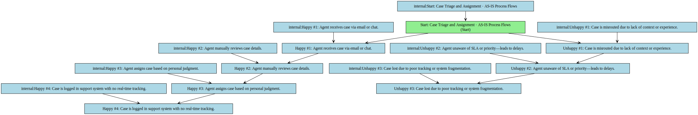
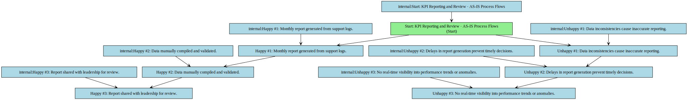
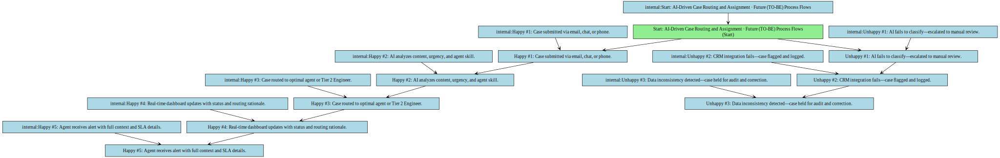
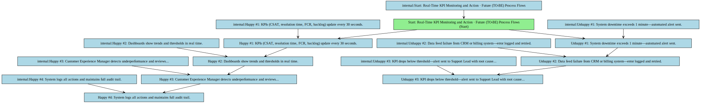

## Functional Specification: AI-Driven Case Routing and Omnichannel Support Platform

**1. Project Overview & Objectives**
This project delivers an AI-powered case routing and omnichannel support platform to improve resolution time, enhance customer satisfaction, and ensure audit compliance through seamless CRM and billing system integration.

*   **Project Objective:** Reduce average case resolution time by 40%, improve CSAT by 25%, achieve 99.9% system uptime, and reduce ticket backlog by 10% monthly through AI-driven workflows, real-time dashboards, and phased rollout adoption.

**2. Scope Boundaries:**
The project focuses on developing and deploying an AI-driven case routing system with omnichannel support, CRM integration, and real-time KPI monitoring, delivered in phases to minimize disruption.

*   **In-Scope:** - Implementation of AI-assisted case routing and prioritization across email, chat, and phone channels. - Integration with CRM and legacy billing systems via API. - Real-time dashboard for KPIs (CSAT, resolution time, FCR, agent productivity, system uptime, backlog reduction). - Role-based access for Analyst, Auditor, Engineer, Admin, and Customer Experience Manager. - Phased rollout with pilot testing and change management. - Automated validation of KPIs and system performance. - Pre-implementation API validation and compliance checks with GDPR and internal policies.
*   **Out-of-Scope:** - Development of new billing system logic or data schema changes. - Full redesign of CRM user interface. - On-premise deployment beyond pilot phase. - Integration with non-critical third-party tools outside the defined scope. - Development of mobile applications for end users.

**3. Current State (As-Is)**

*   Case routing is manual, inconsistent, and often results in delayed resolutions.
*   Agents lack unified visibility across email, chat, and phone channels.
*   KPI tracking is manual, retrospective, and delayed, hindering real-time decision-making.
*   No real-time dashboards or automated alerts exist for performance monitoring.
*   Audit logs are incomplete, and access controls are not role-based or traceable.
*   Tier 2 Support Engineers are not formally recognized or integrated into current workflows.

**As-Is Process Flows**

*   **Case Triage and Assignment:**
    * Happy path:
        * 1. Agent receives case via email or chat.
        * 2. Agent manually reviews case details.
        * 3. Agent assigns case based on personal judgment.
        * 4. Case is logged in support system with no real-time tracking.
    * Unhappy path / exceptions:
        * 1. Case is misrouted due to lack of context or experience.
        * 2. Agent unaware of SLA or priority—leads to delays.
        * 3. Case lost due to poor tracking or system fragmentation.
*   **KPI Reporting and Review:**
    * Happy path:
        * 1. Monthly report generated from support logs.
        * 2. Data manually compiled and validated.
        * 3. Report shared with leadership for review.
    * Unhappy path / exceptions:
        * 1. Data inconsistencies cause inaccurate reporting.
        * 2. Delays in report generation prevent timely decisions.
        * 3. No real-time visibility into performance trends or anomalies.

**4. Future State (To-Be)**

*   AI automatically routes and prioritizes cases across email, chat, and phone based on content, urgency, and agent expertise.
*   Agents access a unified omnichannel interface with real-time KPIs, reducing resolution time by 40%.
*   Customer Experience Managers monitor dashboards and override AI routing with audit-trail logging when needed.
*   Tier 2 Support Engineers gain read/write access to case histories and diagnostic tools for faster escalations.
*   CRM and billing system integrations ensure real-time data flow with automated validation and error alerts.
*   All KPIs are updated every 30 seconds with automated alerts when thresholds are breached.

**Future Process Flows**

*   **AI-Driven Case Routing and Assignment:**
    * Happy path:
        * 1. Case submitted via email, chat, or phone.
        * 2. AI analyzes content, urgency, and agent skill.
        * 3. Case routed to optimal agent or Tier 2 Engineer.
        * 4. Real-time dashboard updates with status and routing rationale.
        * 5. Agent receives alert with full context and SLA details.
    * Unhappy path / exceptions:
        * 1. AI fails to classify—escalated to manual review.
        * 2. CRM integration fails—case flagged and logged.
        * 3. Data inconsistency detected—case held for audit and correction.
*   **Real-Time KPI Monitoring and Action:**
    * Happy path:
        * 1. KPIs (CSAT, resolution time, FCR, backlog) update every 30 seconds.
        * 2. Dashboards show trends and thresholds in real time.
        * 3. Customer Experience Manager detects underperformance and reviews workflow.
        * 4. System logs all actions and maintains full audit trail.
    * Unhappy path / exceptions:
        * 1. System downtime exceeds 1 minute—automated alert sent.
        * 2. Data feed failure from CRM or billing system—error logged and retried.
        * 3. KPI drops below threshold—alert sent to Support Lead with root cause flags.

**5. Stakeholders & Personas**

*   **Analyst:** Frontline support agent responsible for resolving cases using the AI-assisted interface and real-time dashboards.
*   **Auditor:** Compliance officer who reviews system logs, access records, and routing decisions for audit readiness.
*   **Engineer:** Technical lead responsible for system integration, API validation, and troubleshooting.
*   **Admin:** System administrator managing user roles, permissions, and platform configuration.
*   **Customer Experience Manager:** Manager responsible for monitoring KPIs, driving adoption, and initiating limited workflow overrides.

**6. Functional Requirements Overview**
The system enables AI-driven case routing, omnichannel support, real-time KPI dashboards, CRM and billing system integration, and role-based access control with audit trails.

**7. Non-Functional Requirements**

*   System uptime must be 99.9% during business hours.
*   All user roles must have role-based access with least-privilege principles.
*   Real-time dashboards must update within 30 seconds of data change.
*   APIs must support JSON format and OAuth2 authentication.
*   All system changes must be logged and traceable for audit compliance.

**8. Assumptions**

*   Legacy billing system APIs will be accessible and stable by Phase 1 launch.
*   Data quality in source systems is sufficient for AI model training.
*   Support teams will be available for training and change management.
*   Customer Experience Managers will be assigned and trained prior to rollout.
*   Third-party AI vendor will meet GDPR compliance and model accuracy benchmarks.

**9. Risks**

*   Delayed access to legacy billing system APIs may delay integration and impact rollout timeline.
*   AI model inaccuracy could lead to misrouting and decreased agent trust.
*   Regulatory non-compliance with GDPR may result in penalties or rollout suspension.
*   Resistance to change from frontline agents could hinder adoption.
*   System downtime exceeding 1 minute may impact service levels and user trust.

**10. Open Issues**

*   Final API schema from Finance Team pending validation.
*   Customer Experience Manager role permissions not yet fully defined.
*   Long-term data retention policy for audit logs not yet approved.
*   Third-party AI vendor’s compliance documentation not yet delivered.
*   Integration testing environment not yet provisioned.

**11. Functional Requirements**

### Functional Requirements

| Spec ID | Specification Description | Business Rules/Data Dependency |
|---|---|---|
| FR-1 | The system must route incoming cases across email, chat, and phone channels using AI based on content, urgency, and agent skill. | AI model must validate input data format and reject malformed cases; routing must be logged with timestamp and decision rationale. |
| FR-2 | The system must display real-time KPI dashboards for CSAT, resolution time, FCR, agent productivity, system uptime, and ticket backlog. | KPIs must be updated every 30 seconds; all data sources must be validated for consistency and accuracy. |
| FR-3 | The system must integrate with the CRM via API to sync case status, customer history, and agent notes. | API must use JSON format and OAuth2; failed syncs must trigger alerts and retry logic with backoff. |
| FR-4 | The system must integrate with the legacy billing system via API to retrieve account status and billing history for case context. | API must be validated pre-launch; data must be encrypted in transit and at rest; any failure must be logged and reported. |
| FR-5 | The system must enforce role-based access control, ensuring each user role (Analyst, Auditor, Engineer, Admin, Customer Experience Manager) has defined permissions. | Permissions must align with least-privilege principle; all access changes must be logged and auditable. |
| FR-6 | The Customer Experience Manager must have read-only access to all KPI dashboards and limited ability to override AI routing decisions. | Override must require two-factor authentication; all overrides must be logged with reason and timestamp. |
| FR-7 | The system must automatically detect and flag cases with missing or inconsistent data during routing. | Cases with missing fields must be marked as 'pending data' and routed to a review queue; AI model must not process invalid data. |
| FR-8 | The system must generate and store audit logs for all user actions, system events, and AI decisions. | Logs must be retained for 36 months; access to logs must be restricted to Auditor and Admin roles. |
| FR-9 | The system must support phased rollout with pilot testing in one department before enterprise-wide deployment. | Pilot phase must include monitoring, feedback collection, and performance benchmarking before full rollout. |
| FR-10 | The system must send automated alerts when any KPI falls below predefined thresholds. | Alerts must be sent via email and in-app; thresholds must be configurable by Customer Experience Manager. |