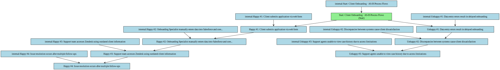
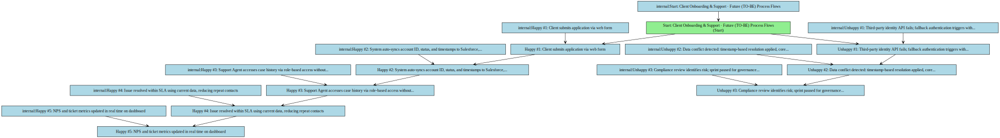

## Functional Specification: Client Onboarding & Support Optimization Initiative

**1. Project Overview & Objectives**
This project aims to streamline client onboarding and support workflows by integrating Salesforce, legacy core banking, and Zendesk systems, enabling real-time data synchronization, role-based access, and reduced support ticket volume by 30%. The initiative supports a 25% improvement in NPS through improved user satisfaction, data-driven decisions, and collaborative stakeholder engagement.

*   **Project Objective:** Improve customer satisfaction by 25%, reduce support tickets by 30%, and ensure compliance with GDPR and PCI-DSS through secure, integrated, and role-based client onboarding and support systems.

**2. Scope Boundaries:**
The project focuses on integrating core systems, defining user roles with granular access controls, and optimizing onboarding and support processes to improve efficiency and customer satisfaction.

*   **In-Scope:** ['Integration of Salesforce, legacy core banking system, and Zendesk for synchronized client data (e.g., account ID, status, interaction timestamps)', 'Implementation of role-based access control for Client Onboarding Specialists, Clients, and Client Support Agents', 'Development of real-time dashboards for tracking NPS and support ticket volume', 'Phased rollout with parallel testing and governance reviews every sprint', 'Compliance validation with GDPR and PCI-DSS, including data ownership and access policies']
*   **Out-of-Scope:** ['Modification of the legacy core banking system’s underlying architecture', 'Development of new financial products or pricing models', 'Integration with external CRM platforms beyond Salesforce', 'Mobile application development for client self-service']

**3. Current State (As-Is)**

*   Client data is manually entered and inconsistently updated across Salesforce, core banking, and Zendesk systems.
*   Support tickets frequently arise due to outdated client information and lack of visibility into case history.
*   Access to client data is not role-based, leading to potential compliance risks and inefficiencies.
*   Onboarding delays occur due to data entry errors and system discrepancies.
*   Support agents cannot view full case history, causing repeated client follow-ups.
*   No real-time dashboards exist for tracking NPS or support ticket volume.

**As-Is Process Flows**

*   **Client Onboarding:**
    * Happy path:
        * 1. Client submits application via web form
        * 2. Onboarding Specialist manually enters data into Salesforce and core banking system
        * 3. Support team accesses Zendesk using outdated client information
        * 4. Issue resolution occurs after multiple follow-ups
    * Unhappy path / exceptions:
        * 1. Data entry errors result in delayed onboarding
        * 2. Discrepancies between systems cause client dissatisfaction
        * 3. Support agents unable to view case history due to access limitations

**4. Future State (To-Be)**

*   Real-time synchronization of client data across Salesforce, core banking, and Zendesk with ≤5-second latency
*   Role-based access ensures Client Support Agents see case history without financial data, enforcing GDPR and PCI-DSS compliance
*   Automated NPS tracking via post-engagement surveys with real-time dashboard updates every 5 minutes
*   Phased rollout with biweekly governance reviews and sprint-level compliance validation to ensure alignment
*   Support ticket volume reduced by 30% through accurate, up-to-date data and faster resolution times
*   Client onboarding delays eliminated via automated data sync and conflict resolution using core banking as source of truth

**Future Process Flows**

*   **Client Onboarding & Support:**
    * Happy path:
        * 1. Client submits application via web form
        * 2. System auto-syncs account ID, status, and timestamps to Salesforce, core banking, and Zendesk in real time
        * 3. Support Agent accesses case history via role-based access without financial data exposure
        * 4. Issue resolved within SLA using current data, reducing repeat contacts
        * 5. NPS and ticket metrics updated in real time on dashboard
    * Unhappy path / exceptions:
        * 1. Third-party identity API fails; fallback authentication triggers with manual review flag
        * 2. Data conflict detected: timestamp-based resolution applied, core banking as source of truth
        * 3. Compliance review identifies risk; sprint paused for governance session and approval

**5. Stakeholders & Personas**

*   **Client Onboarding Specialist:** Responsible for managing client applications and data entry; requires access to full client data and system configuration tools
*   **Client:** End user who submits onboarding applications and receives support; requires self-service access and real-time updates
*   **Client Support Agent:** Resolves support tickets using case history and workflow status; limited to non-financial data and role-based access

**6. Functional Requirements Overview**
The system enables real-time synchronization of client data across Salesforce, core banking, and Zendesk. Role-based access ensures compliance, while automated workflows reduce manual effort and support ticket volume. Real-time dashboards track NPS and ticket metrics to support data-driven decisions.

**7. Non-Functional Requirements**

*   System must maintain GDPR and PCI-DSS compliance at all times
*   Data synchronization latency must not exceed 5 seconds
*   Role-based access controls must be enforced at the API and UI level
*   System must support 10,000 concurrent users during peak load
*   All data changes must be logged and auditable

**8. Assumptions**

*   Third-party identity verification API will remain stable and available
*   Compliance team will be available for bi-weekly governance reviews
*   Legacy system APIs will support the required data fields and sync frequency
*   Stakeholders will participate in sprint reviews as scheduled
*   Client Support Agents will be trained on the new system before go-live

**9. Risks**

*   Third-party API failure may delay onboarding; mitigated by pre-qualified backup providers
*   Data conflict resolution may introduce delays; mitigated by timestamp-based priority with core banking as source of truth
*   Compliance review delays may impact sprint timelines; mitigated by scheduled alignment sessions
*   Legacy system instability may affect data sync; mitigated by phased rollout and parallel testing
*   User resistance to new workflows may impact adoption; mitigated by inclusive stakeholder involvement and training

**10. Open Issues**

*   Final approval process for data flow changes not yet defined
*   Specific fallback authentication method for identity verification not yet selected
*   Long-term scalability of the integration layer under high load remains unverified
*   Client self-service portal features not yet prioritized in roadmap

**11. Functional Requirements**

### Functional Requirements

| Spec ID | Specification Description | Business Rules/Data Dependency |
|---|---|---|
| FR-1 | The system must synchronize client status, account ID, and interaction timestamps between Salesforce, the legacy core banking system, and Zendesk in real time. | Data conflicts are resolved using a timestamp-based priority rule, with the core banking system as the source of truth. |
| FR-2 | Client Support Agents must be able to view case history and workflow status in Zendesk but must not have access to financial data. | Access is enforced through role-based permissions defined in the identity management system. |
| FR-3 | The system must generate real-time dashboards showing NPS and support ticket volume, updated every 5 minutes. | Data is pulled from Salesforce and Zendesk via secure, authenticated API calls. |
| FR-4 | The system must log all data changes and user actions for audit and compliance purposes. | Logs must be retained for at least 7 years and be accessible to authorized compliance personnel. |
| FR-5 | The system must validate client identity using a third-party identity verification API before onboarding completion. | If the API fails, a fallback authentication method must be triggered, and the case must be flagged for manual review. |
| FR-6 | All data synchronization must be governed by cross-functional compliance reviews held every sprint. | No change to data flow or access policy may be implemented without approval from the Project Steering Committee. |
| FR-7 | The system must support phased rollout with parallel testing to minimize disruption to core operations. | Each phase must pass a compliance and performance validation before proceeding to the next. |