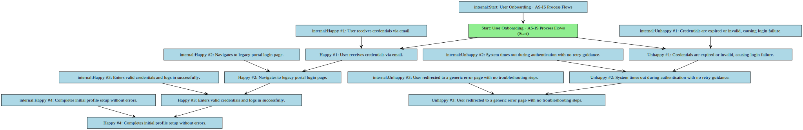
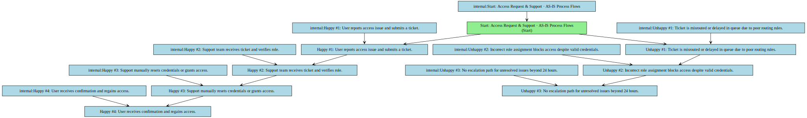
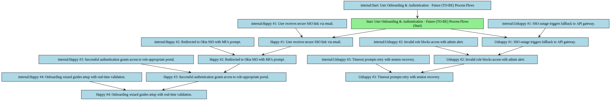
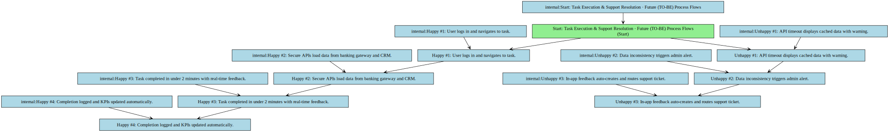

## Functional Specification: Modernization of FinServe Legacy Portal

**1. Project Overview & Objectives**
This project aims to modernize FinServe’s legacy portal by redesigning the user experience, enhancing system integration, and improving usability to achieve a 30% increase in CSAT and a 50% reduction in access-related helpdesk tickets.

*   **Project Objective:** To deliver a secure, scalable, and user-centric digital portal that supports key user personas with streamlined workflows, reduced dependency on support, and improved system performance through modern integration patterns and data-driven design.

**2. Scope Boundaries:**
The project focuses on redesigning and rebuilding the FinServe portal to support modern access patterns, integrate with external systems securely, and improve user satisfaction through iterative development and real-time performance monitoring.

*   **In-Scope:** ['Redesign of the user interface and core workflows for Small Business Admins, Financial Advisors, Compliance Officers, and Internal Support Agents.', 'Implementation of role-based access control (RBAC) aligned with defined user roles and regulatory requirements.', 'Integration with banking gateways, Okta SSO (via OAuth 2.0), and CRM systems using API gateways and secure data flows.', 'Real-time monitoring of KPIs including login success rate (target: 98%), task completion time (<2 minutes), and mobile adoption (80% in 12 months).', 'Development of fallback mechanisms and sandbox testing for third-party API dependencies.', 'Phased rollout with validation via sprint demos and biweekly stakeholder dashboards.']
*   **Out-of-Scope:** ['Migration of legacy data repositories or core backend systems.', 'Development of new financial products or transaction processing logic.', 'Integration with non-critical third-party services outside the defined scope (e.g., marketing platforms).', 'Changes to compliance or audit frameworks beyond existing requirements.']

**3. Current State (As-Is)**

*   Legacy portal has inconsistent navigation, causing frequent login failures and support tickets.
*   Authentication relies on outdated protocols, leading to timeouts and generic error messages.
*   No real-time monitoring of performance or user behavior, hindering proactive issue resolution.
*   Limited mobile support results in poor user experience and low adoption on mobile devices.
*   Manual access requests and credential resets create delays and increase helpdesk workload.

**As-Is Process Flows**

*   **User Onboarding:**
    * Happy path:
        * 1. User receives credentials via email.
        * 2. Navigates to legacy portal login page.
        * 3. Enters valid credentials and logs in successfully.
        * 4. Completes initial profile setup without errors.
    * Unhappy path / exceptions:
        * 1. Credentials are expired or invalid, causing login failure.
        * 2. System times out during authentication with no retry guidance.
        * 3. User redirected to a generic error page with no troubleshooting steps.
*   **Access Request & Support:**
    * Happy path:
        * 1. User reports access issue and submits a ticket.
        * 2. Support team receives ticket and verifies role.
        * 3. Support manually resets credentials or grants access.
        * 4. User receives confirmation and regains access.
    * Unhappy path / exceptions:
        * 1. Ticket is misrouted or delayed in queue due to poor routing rules.
        * 2. Incorrect role assignment blocks access despite valid credentials.
        * 3. No escalation path for unresolved issues beyond 24 hours.

**4. Future State (To-Be)**

*   Users authenticate securely via Okta SSO with MFA, reducing login failures and support tickets by 50%.
*   Role-based access is enforced in real time, ensuring only authorized users access sensitive data and features.
*   All core user journeys complete in under 2 minutes with a 98% success rate, improving efficiency and satisfaction.
*   Mobile adoption reaches 80% within 12 months through responsive design and optimized workflows.
*   Real-time KPIs—login success, task time, and mobile usage—are tracked and shared biweekly to drive data-driven decisions.

**Future Process Flows**

*   **User Onboarding & Authentication:**
    * Happy path:
        * 1. User receives secure SSO link via email.
        * 2. Redirected to Okta SSO with MFA prompt.
        * 3. Successful authentication grants access to role-appropriate portal.
        * 4. Onboarding wizard guides setup with real-time validation.
    * Unhappy path / exceptions:
        * 1. SSO outage triggers fallback to API gateway.
        * 2. Invalid role blocks access with admin alert.
        * 3. Timeout prompts retry with session recovery.
*   **Task Execution & Support Resolution:**
    * Happy path:
        * 1. User logs in and navigates to task.
        * 2. Secure APIs load data from banking gateway and CRM.
        * 3. Task completed in under 2 minutes with real-time feedback.
        * 4. Completion logged and KPIs updated automatically.
    * Unhappy path / exceptions:
        * 1. API timeout displays cached data with warning.
        * 2. Data inconsistency triggers admin alert.
        * 3. In-app feedback auto-creates and routes support ticket.

**5. Stakeholders & Personas**

*   **Small Business Admin:** Responsible for managing business accounts, user access, and compliance reporting. Requires fast, secure access to financial data and role management tools.
*   **Financial Advisor:** Uses the portal to review client portfolios, generate reports, and initiate transactions. Needs real-time data, mobile access, and secure authentication.
*   **Internal Support Agent:** Manages user access, troubleshoots login issues, and resolves support tickets. Relies on real-time dashboards and role validation tools.

**6. Functional Requirements Overview**
The modernized portal will deliver a secure, scalable, and user-focused experience with integrated authentication, role-based access, and real-time performance tracking. All user journeys will be optimized for speed, usability, and compliance.

**7. Non-Functional Requirements**

*   System must maintain 98% login success rate under peak load.
*   All data transmissions must comply with GDPR and PCI-DSS standards.
*   Mobile responsiveness must support 80% adoption within 12 months.
*   APIs must support fallback mechanisms during third-party outages.
*   All user actions must be logged for audit and compliance purposes.

**8. Assumptions**

*   Okta SSO rollout will be completed on schedule and available for integration.
*   Banking gateway APIs will support OAuth 2.0 and provide stable endpoints.
*   User personas will remain consistent throughout the development lifecycle.
*   Internal teams (Security, Legal, Infrastructure) will maintain alignment via shared sprint reviews.
*   Stakeholders will provide timely feedback during sprint demos.

**9. Risks**

*   Delay in Okta SSO rollout may impact authentication timeline and user onboarding.
*   Legacy system integration issues may cause data synchronization failures.
*   Third-party API unavailability could disrupt core workflows and degrade user experience.
*   Low mobile adoption may indicate poor UX or inadequate testing on mobile devices.
*   Insufficient user training or onboarding guidance may reduce CSAT improvement targets.

**10. Open Issues**

*   Final data ownership agreement with Legal team is pending confirmation.
*   Detailed data residency requirements for EU users not yet finalized.
*   Integration testing with banking gateway API not yet scheduled.
*   Mobile-specific performance benchmarks still being defined.
*   Final approval of fallback mechanism logic from Security team is pending.

**11. Functional Requirements**

### Functional Requirements

| Spec ID | Specification Description | Business Rules/Data Dependency |
|---|---|---|
| FR-1 | FR-1: Users must authenticate via Okta SSO using OAuth 2.0 with MFA, ensuring secure and consistent access across devices. | Authentication must be validated against the Okta identity provider. Failed attempts must be logged and trigger a 15-minute lockout. MFA is mandatory for all roles except Internal Support Agents during emergency access. |
| FR-2 | FR-2: The system must enforce RBAC policies based on user role, dynamically restricting access to features and data based on assigned permissions. | Access to financial data and administrative functions must be granted only if the user's role is explicitly mapped in the RBAC policy. Changes to roles must be validated and logged in real time. |
| FR-3 | FR-3: The system must integrate with the banking gateway and CRM via API gateways, ensuring secure, auditable data flows with real-time error handling. | All API calls must use TLS 1.3 and include request signing. Failed responses must trigger a fallback mechanism and log error details. Data must be encrypted in transit and at rest. |
| FR-4 | FR-4: The system must track and report KPIs including login success rate, task completion time, and mobile adoption in real time via biweekly dashboards. | KPIs must be collected via embedded analytics and updated every 5 minutes. Dashboards must be accessible to stakeholders and include trend analysis and anomaly detection. |
| FR-5 | FR-5: The system must support fallback mechanisms during third-party API failures, maintaining core functionality with cached or degraded data. | If the banking gateway API is unreachable for more than 30 seconds, the system must display cached data with a clear warning. Critical operations must block until recovery, with user notification sent via email and in-app alert. |
| FR-6 | FR-6: The system must support mobile-optimized workflows, including touch-friendly UI and responsive design, to achieve 80% mobile adoption within 12 months. | All user journeys must be tested on at least three mobile device types. Performance must meet 2-second load time on 3G networks. Mobile-specific feedback must be collected and analyzed monthly. |