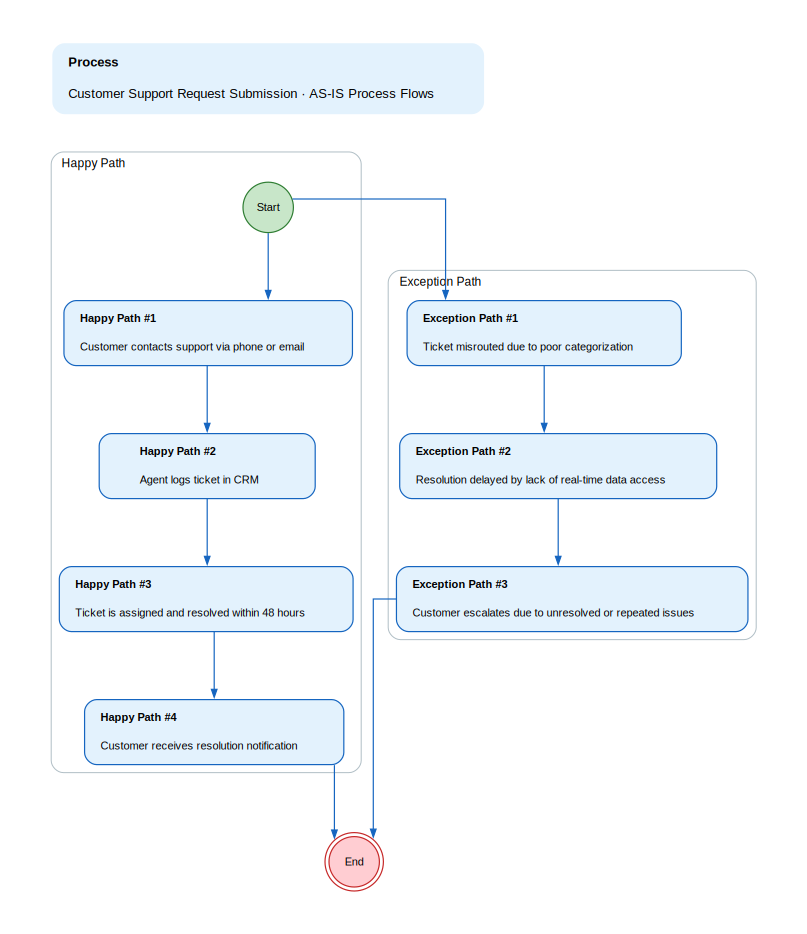
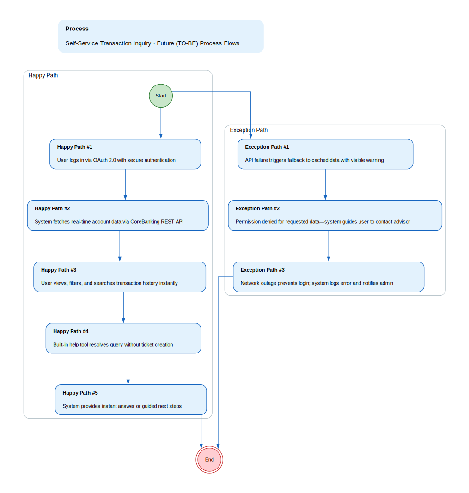

## Functional Specification: Self-Service Portal Enhancement for Reduced Support Tickets and Improved User Satisfaction

**1. Project Overview & Objectives**
This project enhances the customer self-service portal to reduce support tickets by 50%, increase user satisfaction by 40%, and achieve 60% adoption of self-service features through secure, role-based access, real-time integrations, and iterative validation.

*   **Project Objective:** Enable secure, self-service access for customers and advisors via a role-based portal with real-time data and integrated external systems, reducing reliance on support teams while meeting compliance and performance standards.

**2. Scope Boundaries:**
The project focuses on enhancing the self-service portal with role-based access, real-time integrations, and analytics to improve user satisfaction and reduce support load.

*   **In-Scope:** ['Development and deployment of the self-service portal with four defined user personas', 'Integration with CoreBanking (real-time REST APIs), CRM (batch SFTP sync), and Identity Provider (OAuth 2.0)', 'Implementation of real-time dashboards for fraud alerts and transaction monitoring, with near-real-time updates for other metrics', 'Role-based access control (RBAC) with defined permissions per persona', 'Biweekly KPI tracking via dashboards for user satisfaction, support ticket reduction, and self-service adoption', 'Phased rollout with iterative validation and user testing']
*   **Out-of-Scope:** ['Development of new backend systems outside of CoreBanking or CRM', 'Changes to third-party SLAs or data ownership agreements', 'Implementation of AI-driven support chatbots beyond basic self-service workflows']

**3. Current State (As-Is)**

*   Customers resolve account and transaction issues primarily via phone or email, leading to high support volume.
*   CRM and analytics data are updated only once daily, causing delays in user insights and decision-making.
*   Access controls are inconsistent, resulting in over-privileged accounts and frequent access-related support tickets.
*   Support agents lack real-time data, often delaying resolution and increasing SLA breaches.
*   No self-service tools exist for users to independently view transaction history or resolve common issues.

**As-Is Process Flows**

*   **Customer Support Request Submission:**
    * Happy path:
        * 1. Customer contacts support via phone or email
        * 2. Agent logs ticket in CRM
        * 3. Ticket is assigned and resolved within 48 hours
        * 4. Customer receives resolution notification
    * Unhappy path / exceptions:
        * 1. Ticket misrouted due to poor categorization
        * 2. Resolution delayed by lack of real-time data access
        * 3. Customer escalates due to unresolved or repeated issues

**4. Future State (To-Be)**

*   Customers and advisors resolve 60% of issues independently via a secure, role-based self-service portal.
*   Real-time dashboards deliver fraud alerts within 1 second and transaction insights within 5 minutes.
*   Role-based access ensures accurate, secure data visibility with no over-privileged accounts.
*   Support teams focus on complex cases, reducing ticket volume by 50% and improving SLA compliance.
*   User satisfaction increases by 40% through faster, self-driven issue resolution and intuitive design.

**Future Process Flows**

*   **Self-Service Transaction Inquiry:**
    * Happy path:
        * 1. User logs in via OAuth 2.0 with secure authentication
        * 2. System fetches real-time account data via CoreBanking REST API
        * 3. User views, filters, and searches transaction history instantly
        * 4. Built-in help tool resolves query without ticket creation
        * 5. System provides instant answer or guided next steps
    * Unhappy path / exceptions:
        * 1. API failure triggers fallback to cached data with visible warning
        * 2. Permission denied for requested data—system guides user to contact advisor
        * 3. Network outage prevents login; system logs error and notifies admin

**5. Stakeholders & Personas**

*   **Retail Customer:** Individuals seeking account balance, transaction history, and basic support via self-service tools with limited access to personal data.
*   **Small Business Owner:** Business users needing access to account summaries, transaction reports, and payment history with role-based permissions.
*   **Financial Advisor:** Authorized personnel managing client accounts, viewing shared data, and initiating actions within defined scope.
*   **Admin:** System administrators with full access to configuration, user management, and audit logs.

**6. Functional Requirements Overview**
The self-service portal will support four user personas with role-based access, real-time data from CoreBanking, batch-synced CRM data, and secure authentication via OAuth 2.0. Real-time dashboards will track key metrics, with adoption and satisfaction monitored via analytics and surveys.

**7. Non-Functional Requirements**

*   Real-time data access for fraud alerts and transaction monitoring (within 1 second)
*   Near-real-time updates (≤5 minutes) for other dashboard metrics
*   Compliance with GDPR and CCPA for data privacy and user consent
*   System availability of 99.5% during business hours
*   Role-based access control enforced at all system levels

**8. Assumptions**

*   Third-party SLAs for CoreBanking and Identity Provider will be met
*   Team availability remains stable throughout the project lifecycle
*   Users will adopt self-service features once usability and reliability are proven
*   Data ownership remains with FinServe for customer data and third parties for their own data
*   Legacy system constraints will not prevent real-time integration

**9. Risks**

*   Delayed API delivery from CoreBanking team may delay launch by up to 3 weeks
*   SLA breaches from third-party providers could impact real-time data availability
*   Low user adoption due to poor UX or lack of training
*   Data privacy violations due to misconfigured access controls
*   Budget constraints may limit scope expansion or testing resources

**10. Open Issues**

*   Final agreement on data refresh frequency for non-critical metrics (real-time vs. near-real-time)
*   Clarification on responsibility for resolving access errors in the Identity Provider
*   Need for formal sign-off from Compliance team before launch
*   Definition of 'real-time' for FR-5 must be formally agreed upon with technical team
*   Validation process for role permissions during user testing is still being refined

**11. Functional Requirements**

### Functional Requirements

| Spec ID | Specification Description | Business Rules/Data Dependency |
|---|---|---|
| FR-1 | The system shall authenticate users via OAuth 2.0 with the Identity Provider, ensuring secure and compliant access to the self-service portal. | Authentication must comply with OAuth 2.0 standards; session tokens expire after 15 minutes of inactivity. |
| FR-2 | The system shall retrieve real-time account data from CoreBanking using REST APIs for Retail Customers and Small Business Owners. | Data refresh frequency must be ≤1 second for high-priority actions like transaction monitoring; failure triggers fallback to cached data with warning. |
| FR-3 | The system shall sync customer history data from CRM via SFTP every 24 hours, with integrity validation and error logging. | Data sync must complete within 2 hours; failed transfers must be retried up to 3 times before alerting the admin. |
| FR-4 | The system shall enforce role-based access control (RBAC) with defined permissions per persona, including Admin, Financial Advisor, Small Business Owner, and Retail Customer. | Access levels must be tested in every sprint; role permissions cannot be overridden without audit trail. |
| FR-5 | The system shall provide real-time dashboards for fraud alerts and transaction monitoring, with near-real-time updates (≤5 minutes) for other metrics. | Real-time data must be delivered within 1 second; near-real-time data must be updated within 5 minutes; data refresh frequency must be documented and validated in the risk register. |
| FR-6 | The system shall track and report KPIs including user satisfaction (survey), support ticket reduction, and self-service adoption via in-app analytics and CRM integration. | KPIs must be updated biweekly in shared dashboards; deviations must trigger root-cause analysis and stakeholder review. |