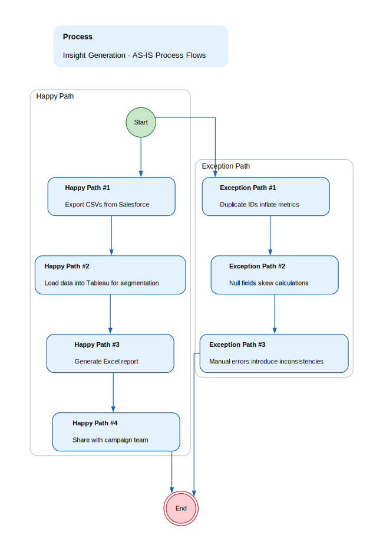
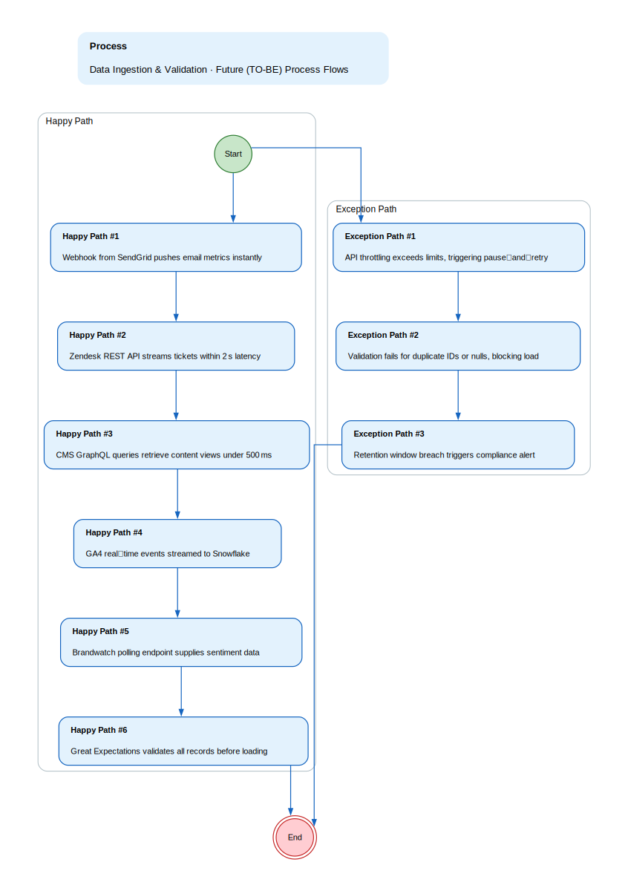
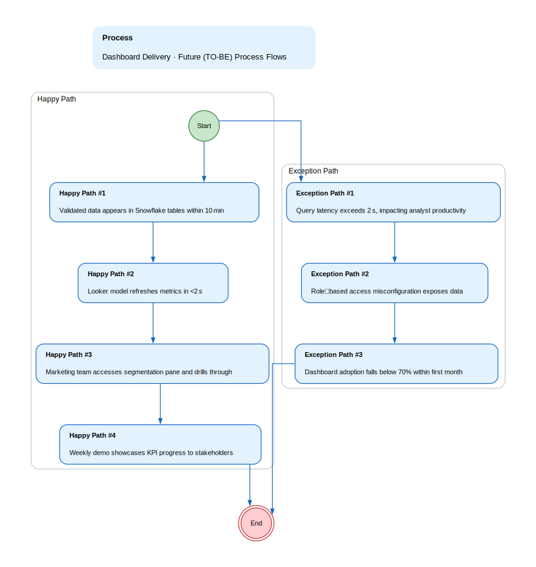

## Functional Specification: Real‑Time Customer Insight Hub Project

**1. Project Overview & Objectives**
A unified live analytics dashboard that consolidates CRM, email, support, content, and analytics data to deliver actionable insights for Q3 campaigns while meeting GDPR/CCPA compliance and budget constraints.

*   **Project Objective:** Deliver a real‑time customer insight hub within 90 days that achieves a 12% conversion uplift, maintains <0.5% data quality errors, and attains 70% dashboard adoption by marketing and analytics teams.

**2. Scope Boundaries:**
Implement real‑time ingestion, data validation, compliance checks, and BI integration for core customer touchpoints.

*   **In-Scope:** - Real‑time streaming from Salesforce, SendGrid, Zendesk, CMS GraphQL, GA4, Brandwatch
- Data quality rules (duplicates, nulls, timestamp windows, sentiment bounds)
- GDPR/CCPA retention enforcement and audit logs
- Tableau/Looker integration for downstream reporting
- Monitoring dashboards with Prometheus/Grafana alerts
*   **Out-of-Scope:** - Advanced predictive modeling or AI recommendation engines
- Deep integrations with new third‑party loyalty platforms
- Additional BI tools beyond Tableau/Looker
- New API contract negotiations outside existing limits

**3. Current State (As-Is)**

*   Marketers manually export Salesforce CSVs, load into Tableau, then build Excel reports—a 3–4 hour manual loop that delays insight delivery.
*   Duplicate customer IDs and null/misaligned fields in the exported data inflate reach metrics and distort conversion calculations.
*   There is no single audit trail or automated validation; stakeholders question data integrity and budgets overrun due to manual errors.

**As-Is Process Flows**

*   **Insight Generation:**
    * Happy path:
        * 1. Export CSVs from Salesforce
        * 2. Load data into Tableau for segmentation
        * 3. Generate Excel report
        * 4. Share with campaign team
    * Unhappy path / exceptions:
        * 1. Duplicate IDs inflate metrics
        * 2. Null fields skew calculations
        * 3. Manual errors introduce inconsistencies

**4. Future State (To-Be)**

*   Real‑time sync from Salesforce to Snowflake within 15 min, cutting insight lag by 90%
*   Automated Great Expectations checks eliminate duplicate and null errors before load
*   Looker segmentation pane delivers instant drill‑through with <2 s latency
*   GDPR/CCPA audit logs retained per policy, ensuring compliance visibility
*   Prometheus/Grafana alerts notify teams of API usage approaching limits

**Future Process Flows**

*   **Data Ingestion & Validation:**
    * Happy path:
        * 1. Webhook from SendGrid pushes email metrics instantly
        * 2. Zendesk REST API streams tickets within 2 s latency
        * 3. CMS GraphQL queries retrieve content views under 500 ms
        * 4. GA4 real‑time events streamed to Snowflake
        * 5. Brandwatch polling endpoint supplies sentiment data
        * 6. Great Expectations validates all records before loading
    * Unhappy path / exceptions:
        * 1. API throttling exceeds limits, triggering pause‑and‑retry
        * 2. Validation fails for duplicate IDs or nulls, blocking load
        * 3. Retention window breach triggers compliance alert
*   **Dashboard Delivery:**
    * Happy path:
        * 1. Validated data appears in Snowflake tables within 10 min
        * 2. Looker model refreshes metrics in <2 s
        * 3. Marketing team accesses segmentation pane and drills through
        * 4. Weekly demo showcases KPI progress to stakeholders
    * Unhappy path / exceptions:
        * 1. Query latency exceeds 2 s, impacting analyst productivity
        * 2. Role‑based access misconfiguration exposes data
        * 3. Dashboard adoption falls below 70% within first month

**5. Stakeholders & Personas**

*   **Campaign Lead:** Read‑only user who drills through insights to inform campaign strategy.
*   **Creative Analyst:** User with query creation rights focused on ad performance slices.
*   **Marketing Data Scientist:** Full query access to raw tables for deep analysis and model building.

**6. Functional Requirements Overview**
The hub ingests data from multiple sources, validates it, stores it in Snowflake, and exposes it through Looker/ Tableau dashboards with real‑time freshness and compliance controls.

**7. Non-Functional Requirements**

*   Encryption at rest (AES‑256) and in transit (TLS 1.3).
*   Audit log retention: 90 days GDPR, 30 days CCPA.
*   API usage monitoring with Prometheus/Grafana alerts.

**8. Assumptions**

*   Two senior developers are available for the data layer refactor.
*   Existing BI tools (Tableau/Looker) can integrate without additional licensing.
*   CRM migration downtime window is known and can be coordinated.
*   API rate limits will remain stable during project execution.

**9. Risks**

*   API throttling could delay ingestion, affecting real‑time freshness.
*   Data quality gaps may erode stakeholder confidence if not caught early.
*   Budget overruns from unexpected API costs or licensing changes.
*   Compliance breaches due to audit log mismanagement.
*   Stakeholder resistance if adoption targets are not met.

**10. Open Issues**

*   Exact timing and duration of CRM migration downtime.
*   Final approval of GDPR/CCPA retention thresholds for all data types.
*   Confirmation of Tableau license capacity beyond 50 concurrent users.
*   Detailed mapping of data lineage from source to dashboard metrics.

**11. Functional Requirements**

### Functional Requirements

| Spec ID | Specification Description | Business Rules/Data Dependency |
|---|---|---|
| FR-1 | Real‑time ingestion from Salesforce into Snowflake via API calls every 15 minutes. | Must respect 150 requests/min limit; data partitioned by customer ID; error handling with retry logic. |
| FR-2 | Email engagement stream from SendGrid using webhooks to capture opens/clicks instantly. | Webhook payload validated for required fields; timestamp must be within last 24 hours. |
| FR-3 | Support ticket ingestion from Zendesk REST API with <2s latency requirement. | Token rotation every 30 days; limit queries to 100 req/s; map status codes to sentiment scores. |
| FR-4 | CMS content view metrics retrieved via GraphQL queries under 500ms per request. | Payload size <500MB; cache results for 5 minutes to avoid throttling. |
| FR-5 | Great Expectations validation rules: duplicate IDs, null fields, timestamp windows, sentiment bounds, and active‑contact flag. | Validation must pass before data is loaded into Snowflake; failures logged and blocked with alert. |