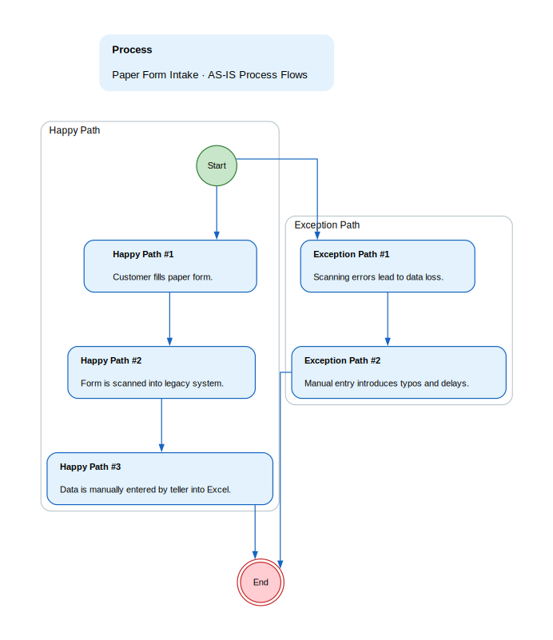
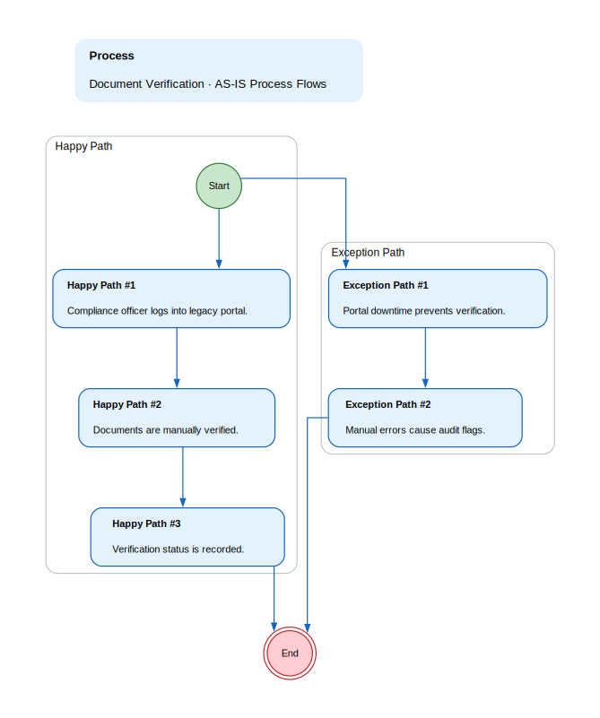
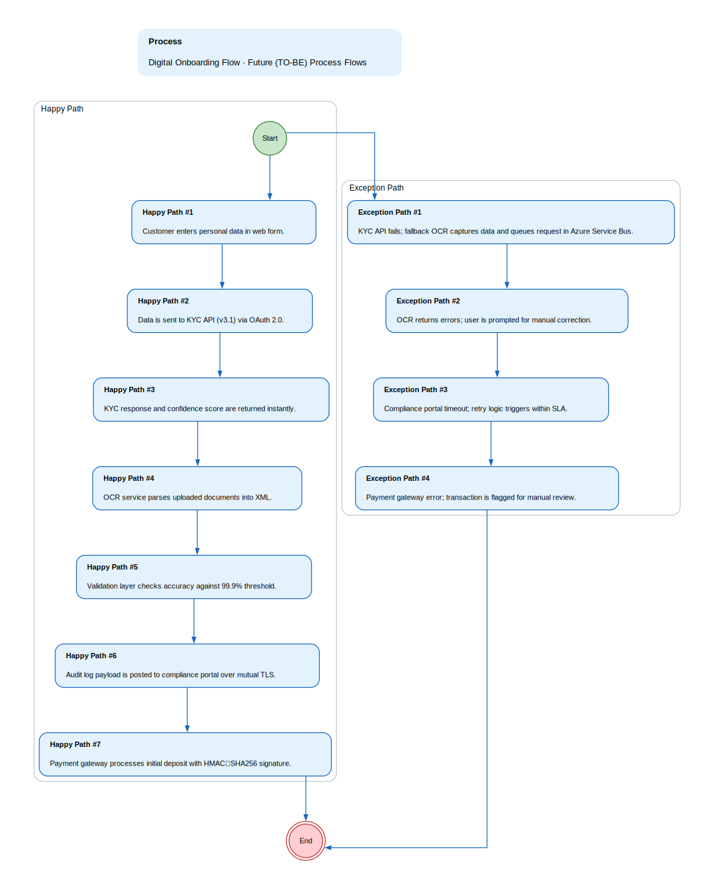

## Functional Specification: Frictionless Account Opening Platform

**1. Project Overview & Objectives**
A digital onboarding solution that reduces account opening cycle time by 40% while ensuring ≥99.9% data accuracy, integrating KYC APIs, OCR services, compliance portal and payment gateway within a hybrid Azure Stack environment.

*   **Project Objective:** Deliver an end‑to‑end automated onboarding flow that meets regulatory compliance, drives rapid user adoption, and provides real‑time KPI dashboards for stakeholders.

**2. Scope Boundaries:**
Implement core digital onboarding with KYC validation, OCR capture, audit logging, and payment initiation while excluding legacy paper processes and additional regulatory checks.

*   **In-Scope:** - Core personal and SME onboarding flows
- Real‑time KYC API integration (v3.1)
- OCR data capture via Tesseract‑cloud (v2.0)
- Audit log sync with compliance portal (REST‑JSON, mutual TLS)
- Payment gateway integration for initial deposits (v4.5)
- 99.9% data accuracy validation layer
- KPI dashboards and reporting
*   **Out-of-Scope:** - Manual approval workarounds
- Legacy paper‑based forms
- Additional regulatory checks beyond current KYC scope
- Non‑core customer support portals

**3. Current State (As-Is)**

*   Customers submit paper forms that are scanned into a legacy system.
*   Back‑office tellers manually enter data into Excel and verify documents in a separate portal.
*   Manual cross‑checks create delays of 3–5 days and increase audit risk.

**As-Is Process Flows**

*   **Paper Form Intake:**
    * Happy path:
        * 1. Customer fills paper form.
        * 2. Form is scanned into legacy system.
        * 3. Data is manually entered by teller into Excel.
    * Unhappy path / exceptions:
        * 1. Scanning errors lead to data loss.
        * 2. Manual entry introduces typos and delays.
*   **Document Verification:**
    * Happy path:
        * 1. Compliance officer logs into legacy portal.
        * 2. Documents are manually verified.
        * 3. Verification status is recorded.
    * Unhappy path / exceptions:
        * 1. Portal downtime prevents verification.
        * 2. Manual errors cause audit flags.

**4. Future State (To-Be)**

*   Enable customers to open accounts in a single web‑form with instant KYC and OCR validation, cutting cycle time by 40%.
*   Automate audit logging to the compliance portal via secure API, ensuring immutable records within 2 seconds.
*   Integrate payment gateway for initial deposits in the same flow, eliminating separate transactions.
*   Deliver real‑time KPI dashboards (cycle time, accuracy, approval rate, CSAT) to stakeholders with drill‑through capability.

**Future Process Flows**

*   **Digital Onboarding Flow:**
    * Happy path:
        * 1. Customer enters personal data in web form.
        * 2. Data is sent to KYC API (v3.1) via OAuth 2.0.
        * 3. KYC response and confidence score are returned instantly.
        * 4. OCR service parses uploaded documents into XML.
        * 5. Validation layer checks accuracy against 99.9% threshold.
        * 6. Audit log payload is posted to compliance portal over mutual TLS.
        * 7. Payment gateway processes initial deposit with HMAC‑SHA256 signature.
    * Unhappy path / exceptions:
        * 1. KYC API fails; fallback OCR captures data and queues request in Azure Service Bus.
        * 2. OCR returns errors; user is prompted for manual correction.
        * 3. Compliance portal timeout; retry logic triggers within SLA.
        * 4. Payment gateway error; transaction is flagged for manual review.

**5. Stakeholders & Personas**

*   **Customer:** End‑user seeking a fast, frictionless account opening experience with instant status updates.
*   **Teller:** Back‑office staff who quickly verifies KYC status and flags exceptions in a secure sandbox.
*   **Compliance Officer:** Regulatory specialist requiring immutable audit logs and real‑time alerts on compliance breaches.

**6. Functional Requirements Overview**
The platform orchestrates data flow between the customer interface, KYC API, OCR service, compliance portal, and payment gateway, ensuring each step meets accuracy, latency, and security requirements while providing KPI visibility to stakeholders.

**7. Non-Functional Requirements**

*   99.9% uptime SLA for onboarding platform.
*   RTO < 1 hour and RPO = 0 in case of failure.
*   Data encryption at rest and in transit (TLS 1.2+).
*   OAuth 2.0 client‑credentials flow with JWT claims.
*   Compliance with GDPR, PCI‑DSS, and local AML/KYC regulations.

**8. Assumptions**

*   KYC provider maintains 99.5% uptime SLA.
*   Legacy compliance portal accepts REST‑JSON over mutual TLS.
*   OCR service will return XML within 2 seconds for typical documents.
*   Azure Stack environment supports required micro‑services architecture.
*   Stakeholders will approve KPI dashboards before sprint planning.

**9. Risks**

*   Both primary and secondary KYC APIs down leading to OCR fallback that increases cycle time by ~15%.
*   Latency spikes in compliance portal causing audit log delays.
*   Regulatory changes requiring additional data fields mid‑project.
*   Scope creep if new optional features are added without approval.
*   Potential data residency conflicts with payment gateway integration.

**10. Open Issues**

*   Final confirmation of payment gateway HMAC‑SHA256 signature format.
*   Detailed retry logic thresholds for each external API.
*   Exact CSAT survey methodology and reporting cadence.
*   Integration playbook completion date for payment gateway.
*   Definition of success metrics threshold for audit pass rate.

**11. Functional Requirements**

### Functional Requirements

| Spec ID | Specification Description | Business Rules/Data Dependency |
|---|---|---|
| FR-1 | Real‑time KYC validation via API v3.1 with OAuth 2.0 authentication. | Each onboarding request must include name, DOB, SSN; response must contain status code and confidence score > 90% for approval. |
| FR-2 | OCR data capture using Tesseract‑cloud v2.0 returning XML with error flags. | XML fields must match predefined schema; any missing mandatory field triggers a user prompt for correction. |
| FR-3 | Audit log synchronization to compliance portal over mutual TLS. | All audit events (KYC call, OCR result, payment status) must be logged within 2 seconds of occurrence and retained immutably. |
| FR-4 | Payment gateway integration for initial deposits using HMAC‑SHA256 signatures. | Transaction ID and status must be returned; failures trigger a retry with exponential backoff up to 3 attempts. |
| FR-5 | Data accuracy validation layer enforcing ≥99.9% accuracy across all captured fields. | Validation compares incoming data against reference records; any discrepancy >0.1% triggers a compliance alert and blocks approval until resolved. |